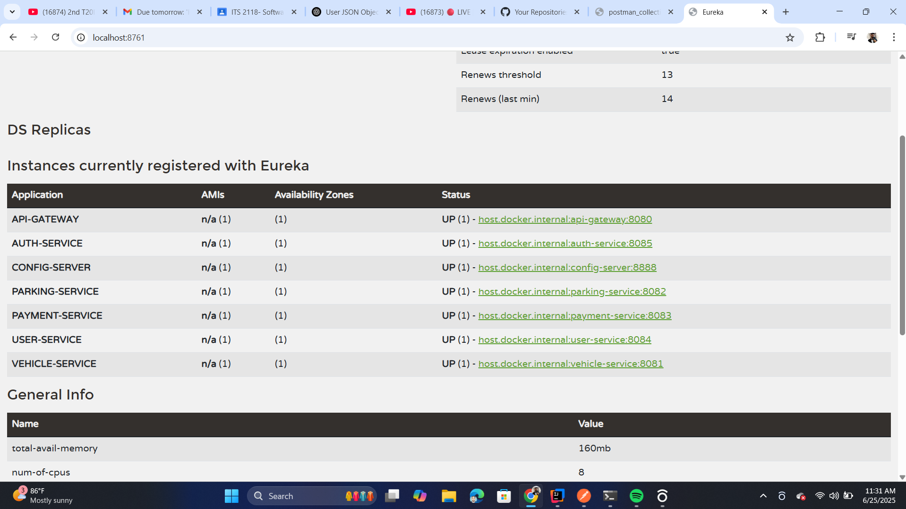

# Smart Parking Management System (SPMS)

This is a cloud-native, microservice-based application to manage real-time parking, payment, and user services.

## 📁 Microservices
- `user-service`
- `vehicle-service`
- `parking-space-service`
- `auth-service`
- `payment-service`
- `config-server`
- `eureka-server`
- `api-gateway`

## 🔐 Authentication
JWT-based login system integrated to protect endpoints.

## 📬 API Testing
Use Postman to test all APIs. Auth token is required for protected routes.

## 📦 Resources
- [Postman Collection](./postman_collection.json)
- 

## 🚀 How to Run
1. Start **Eureka Server** (`localhost:8761`)
2. Start **Config Server** (`localhost:8888`)
3. Start each microservice
4. Start **API Gateway** (`localhost:8080`)
5. Use Postman to send requests

## 📝 Author
Sandunil Malik Bandara
